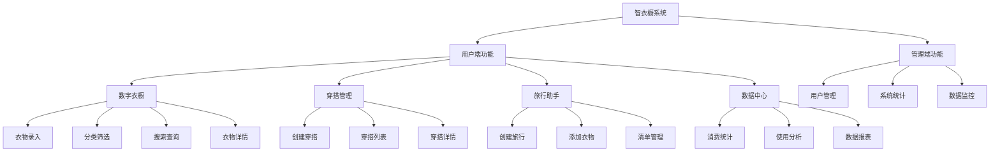
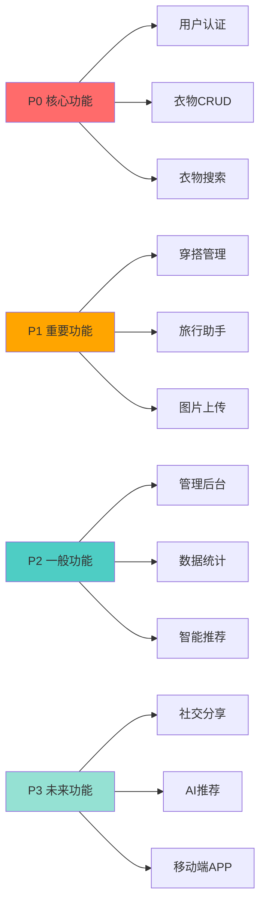
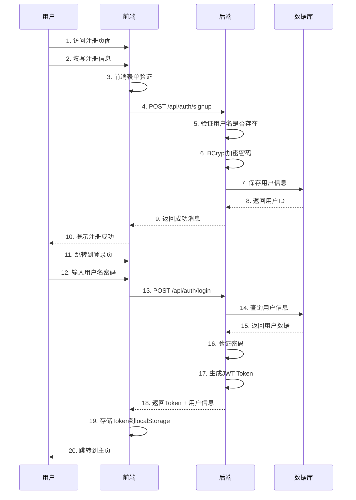
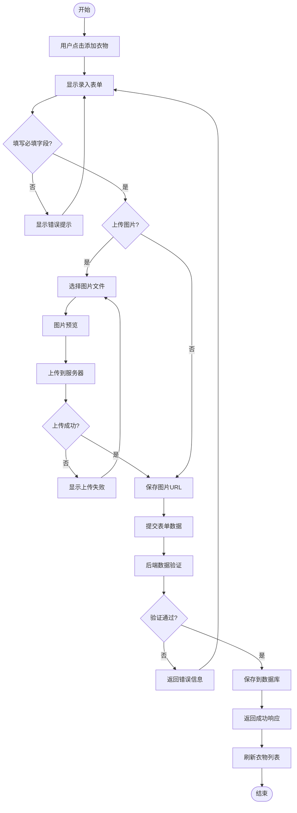
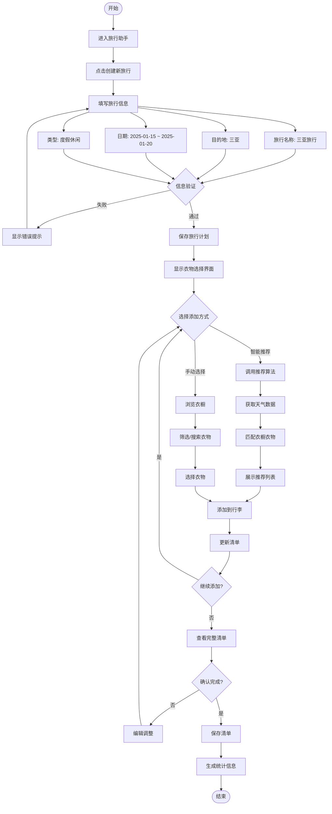
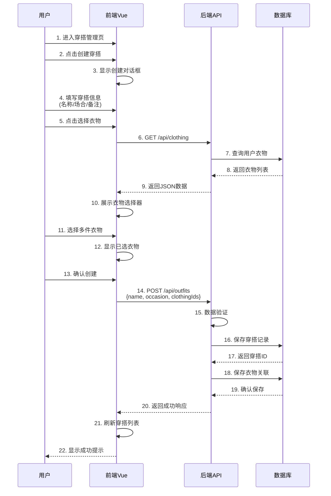
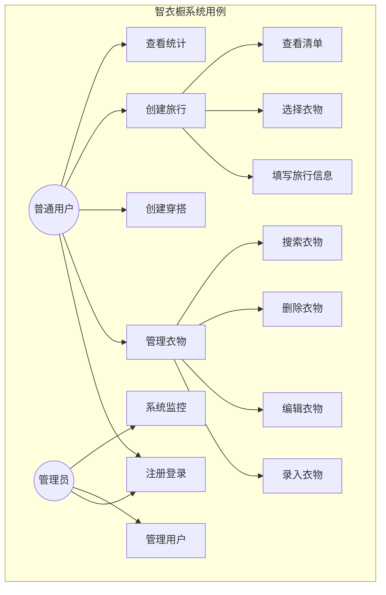

# 产品需求规格说明书 (PRD)
# Product Requirements Document

**项目名称 (Project Name)**: 智衣橱 - Smart Wardrobe  
**文档版本 (Version)**: V2.0  
**编制日期 (Date)**: 2025-12-15  
**文档状态 (Status)**: 正式版 (Official)  
**编制人 (Author)**: 系统架构师 & 产品经理  

---

## 📋 目录 (Table of Contents)

1. [项目概述](#1-项目概述)
2. [产品定位与目标用户](#2-产品定位与目标用户)
3. [功能需求](#3-功能需求)
4. [非功能需求](#4-非功能需求)
5. [业务流程](#5-业务流程)
6. [用户故事与用例](#6-用户故事与用例)
7. [成功指标](#7-成功指标)
8. [风险与假设](#8-风险与假设)

---

## 1. 项目概述

### 1.1 项目背景

在当代消费社会，个人衣物数量不断增加，但管理混乱导致资源浪费严重。据统计，城镇居民平均拥有100+件衣物，但40%年使用不足3次。本系统旨在通过数字化手段解决衣物管理痛点，推动可持续生活方式。

### 1.2 项目愿景

打造一个集衣物管理、智能穿搭、场景助手于一体的个人数字化衣橱系统，帮助用户：
- ✅ 系统化管理衣物资产
- ✅ 提升穿搭决策效率
- ✅ 促进理性消费习惯
- ✅ 践行环保低碳理念

### 1.3 核心价值主张

| 维度 | 价值主张 |
|------|---------|
| 🎯 效率提升 | 3秒查找任意衣物，5分钟规划旅行打包 |
| 💰 成本节约 | 减少30%重复购买，提高50%衣物利用率 |
| 🌱 环保贡献 | 量化碳减排，建立回收机制 |
| 📊 数据洞察 | 可视化消费模式，智能推荐决策 |

### 1.4 技术栈概览

**前端技术**:
- **框架**: Vue.js 3.x (Composition API)
- **UI库**: Element Plus
- **状态管理**: Pinia
- **路由**: Vue Router 4
- **构建工具**: Vite
- **HTTP客户端**: Axios

**后端技术**:
- **框架**: Spring Boot 2.7.18
- **数据库**: MySQL 5.7/8.0
- **缓存**: Redis (可选)
- **安全**: Spring Security + JWT
- **ORM**: Spring Data JPA
- **API文档**: Swagger/OpenAPI

**部署方案**:
- **容器化**: Docker + Docker Compose
- **Web服务器**: Nginx (反向代理)
- **CI/CD**: GitHub Actions (可选)

---

## 2. 产品定位与目标用户

### 2.1 产品定位

**类型**: SaaS Web应用 - 个人衣橱管理系统  
**市场**: C端用户（个人消费者）  
**差异化**: 融合断舍离理念 + 数据驱动决策 + 环保激励机制

### 2.2 目标用户画像

#### 主要用户群体

**User Persona 1: 职场女性小美**
- **年龄**: 25-35岁
- **职业**: 互联网公司产品经理
- **痛点**: 
  - 衣柜爆满但不知道穿什么
  - 经常重复购买相似衣物
  - 旅行打包总是遗漏物品
- **需求**: 
  - 快速查找衣物
  - 穿搭灵感推荐
  - 旅行清单助手

**User Persona 2: 环保主义者小李**
- **年龄**: 22-28岁
- **职业**: 大学生/自由职业者
- **痛点**: 
  - 想要断舍离但不知从何开始
  - 闲置衣物堆积无处处理
- **需求**: 
  - 衣物使用率分析
  - 环保贡献可视化
  - 捐赠回收引导

**User Persona 3: 时尚达人小张**
- **年龄**: 20-30岁
- **职业**: 时尚博主/美妆达人
- **痛点**: 
  - 穿搭记录管理困难
  - 需要系统化管理衣物库
- **需求**: 
  - OOTD日历记录
  - 穿搭方案创建
  - 数据统计分析

### 2.3 用户使用场景

| 场景 | 用户目标 | 系统支持 |
|------|---------|---------|
| 🏠 日常管理 | 录入新衣物、查询衣物 | 快速录入、智能分类、模糊搜索 |
| 👔 早晨出门 | 快速决定穿什么 | 天气推荐、场合推荐 |
| ✈️ 旅行准备 | 高效打包行李 | 智能清单生成、物品勾选 |
| 📊 月度回顾 | 了解消费习惯 | 数据报表、可视化图表 |
| ♻️ 断舍离 | 处理闲置衣物 | 使用率分析、回收引导 |

---

## 3. 功能需求

### 3.1 功能架构图



### 3.2 核心功能详述

#### 3.2.1 数字衣橱模块

**功能优先级**: ⭐⭐⭐⭐⭐ (P0 - 核心功能)

**功能列表**:

| 功能点 | 描述 | 优先级 |
|--------|------|--------|
| F-W-001 | 衣物录入（名称、类别、颜色、品牌等） | P0 |
| F-W-002 | 衣物图片上传（支持多图） | P0 |
| F-W-003 | 衣物编辑与删除 | P0 |
| F-W-004 | 按类别筛选（上衣、裤装、裙装等） | P0 |
| F-W-005 | 按季节筛选（春夏秋冬） | P1 |
| F-W-006 | 按颜色筛选 | P1 |
| F-W-007 | 关键词搜索 | P0 |
| F-W-008 | 衣物详情查看 | P0 |
| F-W-009 | 批量删除衣物 | P2 |

**数据模型 - Clothing Entity**:
```
Clothing {
  id: Long (主键)
  userId: Long (所属用户)
  name: String (衣物名称)
  category: Enum (类别: TOP, BOTTOM, DRESS, OUTERWEAR, SHOES, ACCESSORY)
  color: String (颜色)
  brand: String (品牌)
  price: Decimal (价格)
  size: String (尺寸)
  season: Enum (季节: SPRING, SUMMER, AUTUMN, WINTER, ALL_SEASON)
  material: String (材质)
  imageUrl: String (图片URL)
  purchaseDate: Date (购买日期)
  notes: Text (备注)
  status: Enum (状态: IN_USE, IDLE, DONATED, RECYCLED)
  createdAt: DateTime
  updatedAt: DateTime
}
```

#### 3.2.2 穿搭管理模块

**功能优先级**: ⭐⭐⭐⭐ (P1 - 重要功能)

**功能列表**:

| 功能点 | 描述 | 优先级 |
|--------|------|--------|
| F-O-001 | 创建穿搭方案 | P1 |
| F-O-002 | 从衣橱选择衣物加入穿搭 | P1 |
| F-O-003 | 设置穿搭场合（日常、工作、约会等） | P1 |
| F-O-004 | 添加穿搭备注 | P1 |
| F-O-005 | 穿搭列表查看 | P1 |
| F-O-006 | 穿搭详情查看 | P1 |
| F-O-007 | 编辑穿搭方案 | P1 |
| F-O-008 | 删除穿搭方案 | P1 |
| F-O-009 | 穿搭方案分享（生成图片） | P3 |

**数据模型 - Outfit Entity**:
```
Outfit {
  id: Long (主键)
  userId: Long (所属用户)
  name: String (穿搭名称)
  occasion: Enum (场合: DAILY, WORK, DATE, SPORT, FORMAL, CASUAL)
  description: Text (描述/备注)
  clothingIds: List<Long> (关联的衣物ID列表)
  createdAt: DateTime
  updatedAt: DateTime
}
```

#### 3.2.3 旅行助手模块

**功能优先级**: ⭐⭐⭐⭐ (P1 - 重要功能)

**功能列表**:

| 功能点 | 描述 | 优先级 |
|--------|------|--------|
| F-T-001 | 创建旅行计划 | P1 |
| F-T-002 | 设置目的地、日期、类型 | P1 |
| F-T-003 | 智能推荐衣物（基于天气） | P2 |
| F-T-004 | 手动添加衣物到行李 | P1 |
| F-T-005 | 移除行李衣物 | P1 |
| F-T-006 | 查看旅行清单 | P1 |
| F-T-007 | 编辑旅行计划 | P1 |
| F-T-008 | 删除旅行计划 | P1 |
| F-T-009 | 导出清单（PDF/图片） | P3 |

**数据模型 - TravelPlan Entity**:
```
TravelPlan {
  id: Long (主键)
  userId: Long (所属用户)
  name: String (旅行名称)
  destination: String (目的地)
  startDate: Date (出发日期)
  endDate: Date (返程日期)
  travelType: Enum (类型: LEISURE, BUSINESS, ADVENTURE)
  notes: Text (备注)
  clothingIds: List<Long> (行李衣物ID列表)
  createdAt: DateTime
  updatedAt: DateTime
}
```

#### 3.2.4 用户认证与授权

**功能优先级**: ⭐⭐⭐⭐⭐ (P0 - 核心功能)

**功能列表**:

| 功能点 | 描述 | 优先级 |
|--------|------|--------|
| F-A-001 | 用户注册 | P0 |
| F-A-002 | 用户登录（JWT Token） | P0 |
| F-A-003 | 用户退出登录 | P0 |
| F-A-004 | Token刷新机制 | P1 |
| F-A-005 | 密码加密存储（BCrypt） | P0 |
| F-A-006 | 角色管理（USER/ADMIN） | P0 |
| F-A-007 | 权限验证中间件 | P0 |

#### 3.2.5 管理员功能

**功能优先级**: ⭐⭐⭐ (P2 - 一般功能)

**功能列表**:

| 功能点 | 描述 | 优先级 |
|--------|------|--------|
| F-AD-001 | 查看系统统计数据 | P2 |
| F-AD-002 | 用户列表管理 | P2 |
| F-AD-003 | 查看用户详情 | P2 |
| F-AD-004 | 数据可视化图表 | P2 |
| F-AD-005 | 活动日志查询 | P2 |

### 3.3 功能需求优先级矩阵



---

## 4. 非功能需求

### 4.1 性能需求

| 指标 | 目标值 | 测量方式 |
|------|--------|---------|
| 页面加载时间 | ≤ 2秒 | Chrome DevTools |
| API响应时间 | ≤ 500ms (P95) | 后端日志 |
| 图片上传速度 | ≤ 3秒 (5MB) | 实际测试 |
| 并发用户数 | 支持500+ | 压力测试 |
| 数据库查询 | ≤ 100ms | SQL慢查询日志 |

### 4.2 安全需求

| 需求 | 实现方案 |
|------|---------|
| 密码安全 | BCrypt加密，不可逆 |
| 认证机制 | JWT Token，有效期24小时 |
| 数据隔离 | 基于userId的数据权限控制 |
| SQL注入防护 | JPA参数化查询 |
| XSS防护 | 前端输入过滤 + 后端验证 |
| HTTPS | 生产环境强制HTTPS |
| API限流 | Redis + 令牌桶算法（可选） |

### 4.3 可用性需求

| 维度 | 要求 |
|------|------|
| 系统可用性 | 99.5% (月度) |
| 故障恢复时间 | ≤ 30分钟 |
| 数据备份 | 每日自动备份 |
| 错误提示 | 友好、明确、可操作 |
| 操作引导 | 首次使用提供引导 |

### 4.4 兼容性需求

**浏览器支持**:
- ✅ Chrome 90+ (主要支持)
- ✅ Firefox 88+
- ✅ Safari 14+
- ✅ Edge 90+

**屏幕分辨率**:
- ✅ Desktop: 1366x768 及以上
- ✅ Tablet: 768x1024 (基本支持)
- ⚠️ Mobile: 响应式布局（部分功能）

### 4.5 可维护性需求

| 维度 | 要求 |
|------|------|
| 代码规范 | 遵循Java/Vue代码规范 |
| 注释覆盖率 | 关键方法必须注释 |
| 单元测试 | 核心业务逻辑覆盖率 ≥ 60% |
| 日志记录 | 分级日志（INFO/WARN/ERROR） |
| API文档 | Swagger自动生成 |

---

## 5. 业务流程

### 5.1 用户注册登录流程



### 5.2 衣物录入流程



### 5.3 创建旅行清单完整流程



### 5.4 穿搭方案创建流程



---

## 6. 用户故事与用例

### 6.1 Epic 与 User Stories

**Epic 1: 衣橱数字化管理**

| ID | User Story | Acceptance Criteria |
|----|-----------|---------------------|
| US-001 | 作为用户，我希望能够快速录入新购买的衣物，以便建立数字衣橱 | - 表单包含所有必填字段<br>- 支持图片上传<br>- 1分钟内完成录入 |
| US-002 | 作为用户，我希望能够按类别查看衣物，以便快速找到想要的衣服 | - 提供类别筛选器<br>- 实时过滤结果<br>- 显示衣物数量统计 |
| US-003 | 作为用户，我希望能够搜索衣物，以便通过关键词快速定位 | - 支持模糊搜索<br>- 搜索名称/品牌/颜色<br>- ≤1秒返回结果 |

**Epic 2: 智能穿搭助手**

| ID | User Story | Acceptance Criteria |
|----|-----------|---------------------|
| US-004 | 作为用户，我希望能够创建穿搭方案，以便记录喜欢的搭配 | - 可选择多件衣物<br>- 可设置场合标签<br>- 可添加备注 |
| US-005 | 作为用户，我希望能够查看所有穿搭方案，以便寻找灵感 | - 列表/网格视图<br>- 显示衣物预览图<br>- 支持筛选排序 |

**Epic 3: 旅行打包助手**

| ID | User Story | Acceptance Criteria |
|----|-----------|---------------------|
| US-006 | 作为用户，我希望能够创建旅行清单，以便高效准备行李 | - 填写目的地和日期<br>- 选择旅行类型<br>- 保存清单 |
| US-007 | 作为用户，我希望系统能推荐合适的衣物，以便节省打包时间 | - 基于天气推荐<br>- 基于天数计算数量<br>- 可接受/拒绝推荐 |

### 6.2 用例图



### 6.3 用例详述：创建旅行清单

**用例名称**: 创建旅行清单  
**用例ID**: UC-T-001  
**主要参与者**: 注册用户  
**前置条件**: 用户已登录，衣橱中已有衣物  
**后置条件**: 旅行清单创建成功并保存

**主要流程**:
1. 用户进入旅行助手页面
2. 点击"创建新旅行"按钮
3. 填写旅行信息（名称、目的地、日期、类型）
4. 系统验证输入数据
5. 系统保存旅行计划
6. 用户选择添加衣物
7. 系统展示衣橱衣物列表
8. 用户选择衣物添加到行李
9. 系统更新清单
10. 用户确认完成
11. 系统保存最终清单

**备选流程**:
- 4a. 数据验证失败 → 提示错误并返回步骤3
- 6a. 用户选择智能推荐 → 系统根据算法推荐衣物
- 8a. 用户移除已添加衣物 → 系统更新清单

**异常流程**:
- 网络中断 → 本地缓存数据，待恢复后同步
- 服务器错误 → 显示友好错误提示

---

## 7. 成功指标

### 7.1 产品指标 (Product Metrics)

| 指标类别 | 具体指标 | 目标值 | 测量周期 |
|---------|---------|--------|---------|
| 用户增长 | 注册用户数 | 1000+ | 3个月 |
| 用户活跃 | 日活跃用户(DAU) | 200+ | 每日 |
| 用户留存 | 7日留存率 | ≥40% | 每周 |
| 用户留存 | 30日留存率 | ≥20% | 每月 |
| 功能使用 | 衣物录入量 | 平均50件/用户 | 每月 |
| 功能使用 | 穿搭创建量 | 平均5个/用户 | 每月 |
| 功能使用 | 旅行创建量 | 平均2个/用户 | 每月 |

### 7.2 技术指标 (Technical Metrics)

| 指标 | 目标值 | 测量方式 |
|------|--------|---------|
| API成功率 | ≥99.5% | 日志监控 |
| 平均响应时间 | ≤500ms | APM工具 |
| 错误率 | ≤0.1% | 错误追踪 |
| 系统可用性 | ≥99% | Uptime监控 |

### 7.3 业务指标 (Business Metrics)

| 指标 | 目标值 | 说明 |
|------|--------|------|
| 用户满意度 | ≥4.0/5.0 | NPS调查 |
| 功能完成度 | 100% P0/P1 | 开发进度 |
| Bug密度 | ≤5个/模块 | 测试报告 |

---

## 8. 风险与假设

### 8.1 技术风险

| 风险 | 影响 | 概率 | 应对策略 |
|------|------|------|---------|
| 图片存储成本高 | 中 | 高 | 图片压缩、CDN优化、限制上传数量 |
| 数据库性能瓶颈 | 高 | 中 | 索引优化、Redis缓存、读写分离 |
| 第三方API不稳定 | 中 | 中 | 本地缓存、降级方案、多供应商 |

### 8.2 业务假设

1. ✅ **假设1**: 目标用户愿意花时间录入衣物信息
   - 验证方式: 用户访谈、MVP测试

2. ✅ **假设2**: 数字化管理能提升用户衣物利用率
   - 验证方式: 数据追踪、用户反馈

3. ✅ **假设3**: 用户关注环保和理性消费
   - 验证方式: 市场调研、功能使用率

### 8.3 依赖关系

| 依赖项 | 类型 | 影响 | 状态 |
|--------|------|------|------|
| MySQL数据库 | 技术 | 高 | ✅ 已就绪 |
| Vue.js框架 | 技术 | 高 | ✅ 已就绪 |
| Spring Boot | 技术 | 高 | ✅ 已就绪 |
| Docker环境 | 部署 | 中 | ✅ 已就绪 |
| 云服务器 | 基础设施 | 中 | ⚠️ 待确认 |

---

## 附录

### A. 术语表

| 术语 | 英文 | 解释 |
|------|------|------|
| 衣橱 | Wardrobe | 存放衣物的虚拟空间 |
| 穿搭 | Outfit | 衣物的搭配组合 |
| OOTD | Outfit Of The Day | 每日穿搭记录 |
| 断舍离 | Danshari | 日本生活理念，减少不必要物品 |
| JWT | JSON Web Token | 无状态身份验证令牌 |

### B. 参考文档

- 系统设计文档 (SDD.md)
- 用户操作手册 (USER_MANUAL.md)
- API接口文档 (Swagger)
- 数据库设计文档

### C. 变更历史

| 版本 | 日期 | 修改内容 | 作者 |
|------|------|---------|------|
| V1.0 | 2025-12 | 初始版本 | 产品团队 |
| V2.0 | 2025-12-15 | 完善流程图和用例 | 架构师 |

---

**文档状态**: ✅ 已批准  
**下一步行动**: 进入系统设计阶段 (SDD)  
**责任人**: 系统架构师  
**审批人**: 产品经理  

---

*本文档是智衣橱系统的核心需求规格说明，所有开发活动需以此为准。*
